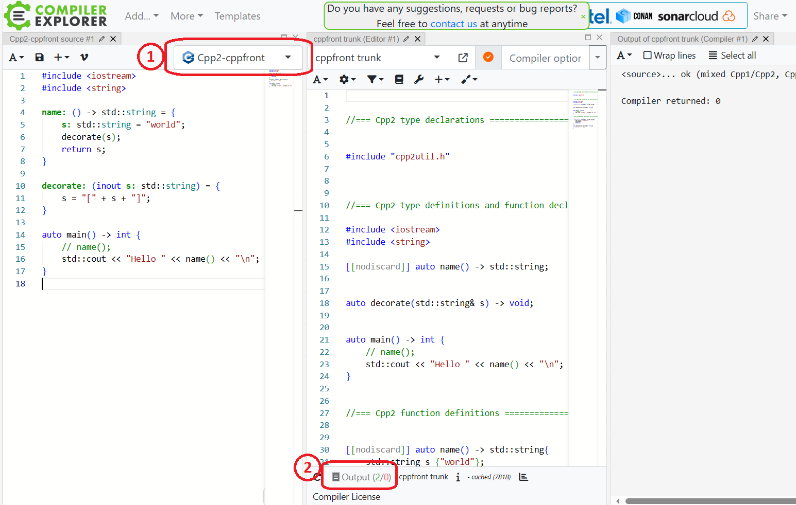

# Getting Started with Cppfront: Setup and Beyond


Back to Tutorial [home](../readme.md)

Back to the Chapter [Overview](Overview.md)

External ref: [Cppfront repo](https://github.com/hsutter/cppfront).

Embarking on your journey with Cppfront? You're in the right place. This chapter is dedicated to familiarizing you with the intricacies of setting up and navigating through the Cppfront landscape. From step-by-step installation instructions to nuances of the compilation process and an introduction to its standout features, we've got you covered. By the end of this section, you'll not only have a running setup but will also be adept at harnessing the array of options that Cppfront offers to its users. Let's dive in.

## Installation

Before diving into Cppfront, you'll need to download and compile it. Fortunately, Cppfront is compatible with any primary C++20 compiler.

From the `[cppfront]/source` directory, execute the following:

- For MSVC [^1]:
```bash
cl cppfront.cpp -std:c++20 -EHsc
```

- For GCC (version 10 and above):
```bash
g++ cppfront.cpp -std=c++20 -o cppfront
```

- For Clang (version 12 and above):
```bash
clang++ cppfront.cpp -std=c++20 -o cppfront
```

After building, it's a good idea to move the tool to the Cppfront base directory:
```bash
mv cppfront ../
```

Explore some example programs available in the [[cppfront]/proj](../../proj/readme.md) directory.

For Linux users, remember to execute the `init.sh` script: 
```bash
. ./init.sh
```

This sets up the necessary environment variables. The script assumes the Cppfront tool binary is located in the base directory of Cppfront.


## Transpilation Process

Before Cppfront code is ready for compilation with GCC, Clang, or Visual Studio [^1], it needs to be transpiled to C++ [^2]. To achieve this, execute the following:

```bash
$ cppfront hello.cpp2
```

To view all available options, run `cppfront -h`. By default, this command generates a C++ file with an identical name (`*.cpp`) within the same directory. To specify a different output file, use the `-o [newname].cpp2` option. Also, the tool operates in "mixed mode" by default, allowing for a blend of both C++ and Cppfront syntax. If you wish to use only pure Cppfront syntax, utilize the `-p` option.

[^1]: This tutorial predominantly targets Linux users, with all examples having been tested on WSL. For guidance on setting up Visual Studio, refer to [Cpp2-setup: Visual Studio](https://github.com/hsutter/cppfront/wiki/Cpp2-setup:-Visual-Studio).

[^2]: Transpilation entails the conversion of source code from one language to another with a similar level of abstraction. Such tools are also known as source-to-source compilers.


## Compilation

In this section, we'll discuss the compilation process using two compiler options: GCC and Clang.

### Clang

To compile with Clang, use:

```bash
$ clang++ hello.cpp -I$CPPFRONTDIR/include/ -std=c++20 -o hello
```

Or for debugging purposes:

```bash
$ clang++ -fuse-line-directives -O0 -g -I$CPPFRONTDIR/include/ -std=c++20 hello.cpp -o hello
```

When debugging, it's necessary to use the `-fuse-line-directives` and `-g` flags. The `-fuse-line-directives` option ensures that LLVM references the `.cpp2` file instead of the `.cpp` file during debugging.

### GCC (g++)

To compile with GCC, use:

```bash
$ g++ -I$CPPFRONTDIR/include/ -std=c++20 hello.cpp -o hello
```

Or for debugging:

```bash
$ g++ -O0 -g -I$CPPFRONTDIR/include/ -std=c++20 hello.cpp -o hello
```

With `gdb`, the debugger will automatically reference the `.cpp2` file. No special directive is required other than the `-g` flag.

## Compiler Errors

When compiling a `.cpp` file generated from `.cpp2`, any compiler errors or warnings will reference the `.cpp2` file, just as the debugger does. For example:

```
$ clang++ hello.cpp -I$CPPFRONTDIR/include/ -std=c++20 -o hello
hello.cpp2:6:1: error: unknown type name ...
```

## Debugging

Debugging in Cppfront has been tested using both `gdb` and `lldb`. Generally, it functions seamlessly. However, for `lldb` to work properly, it's important to ensure that the Clang compiler was invoked with the `-fuse-line-directives` option.

**Example:**

The example below demonstrates how to initiate the `gdb` debugger (the exact same steps apply for `lldb`) and set a breakpoint at the `main` function. In this scenario, the debugger highlights the first line of code within the `main` function.

> **Note:** In the example, lines containing just a `.` denote omitted terminal information, providing a streamlined view focusing on the essential details.

```bash
$ gdb hello
.
.
.
(gdb) b main
.
(gdb) run
.
.
.
Breakpoint 1, main (argc_=1, argv_=0x7fffffffde38) at /home/leandro/projects/cppfront/proj/hello1/hello.cpp2:4
4               mytext: std::string = "my text.";
(gdb) quit
```

## Compiler Explorer

[Compiler Explorer](https://godbolt.org/) is an excellent platform to delve into Cppfront transpilation. Here, you can draft code using Cpp2 syntax and simultaneously view the corresponding generated C++ code as well as the transpilation output.

.

- To opt for Cppfront, use the highlighted selector marked as 1.
- To reveal the output panel (on the right), click the highlighted button labeled 2.

## Next

To the [next Chapter](First_Program.md). {style=text-align:center}

To the [previous Chapter](Cppfront_VS_Rust.md).

Back to Tutorial [home](../readme.md)

Back to the Chapter [Overview](Overview.md)
